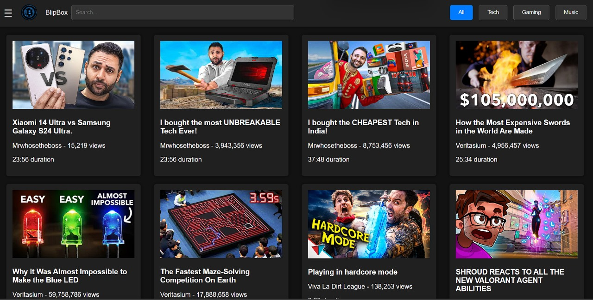
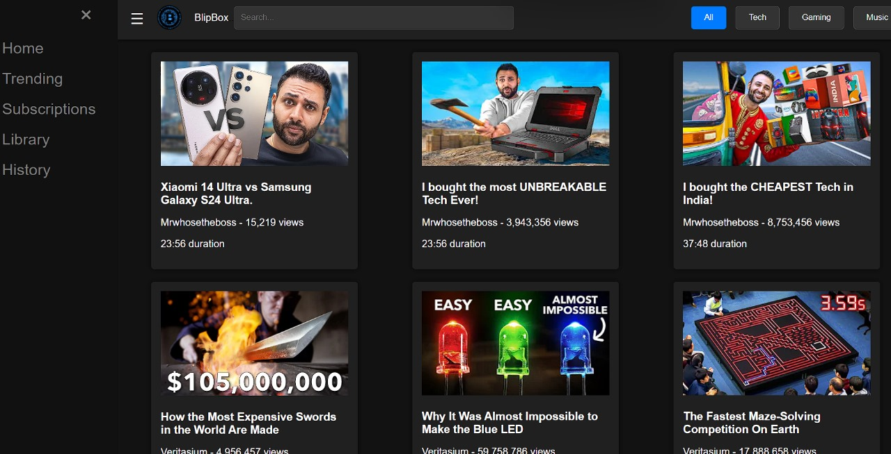
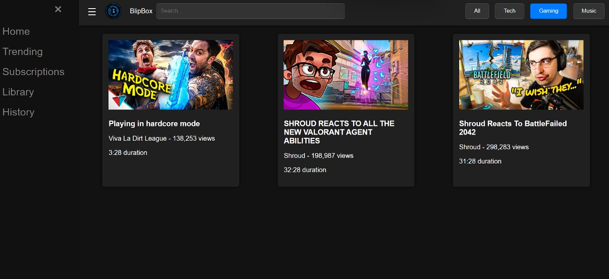
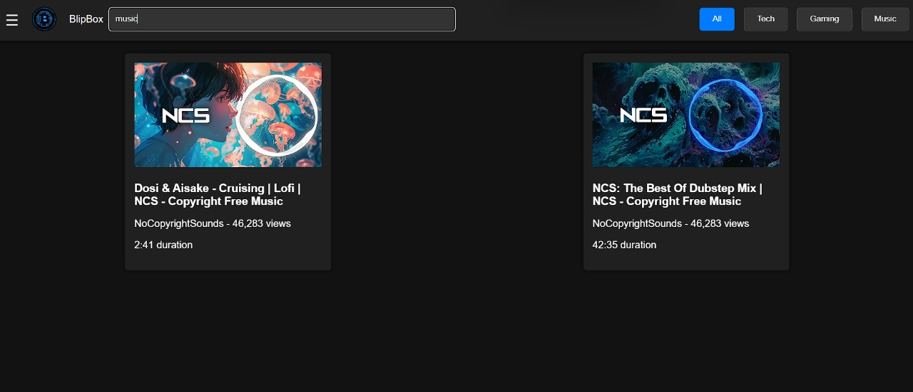

# BlipBox Streaming Web Application

Welcome to BlipBox - a sleek, minimalistic video streaming platform where users can enjoy a curated selection of videos across various categories. Crafted with the latest web technologies, BlipBox delivers a seamless and responsive user experience, free from the complexities of server-side processing.

 
#side bar

#categorization

#search filtering

## Features

- **Static Data Integration**: Leverages an array of video data to simulate a fully-functional streaming experience.
- **Responsive Design**: Ensures a consistent and fluid experience across all devices, from desktop to mobile.
- **Interactive UI Elements**: Allows users to filter videos by categories such as 'All', 'Tech', 'Gaming', and 'Music'.
- **Search Functionality**: Offers a live search feature to quickly locate videos by title.
- **Pure Frontend Implementation**: Utilizes HTML, CSS, and JavaScript for a simple yet powerful frontend architecture.

## Getting Started

To get a local copy up and running follow these simple steps.

### Prerequisites

Before you begin, ensure you have met the following requirements:
- You have a modern web browser.
- You have a basic understanding of HTML/CSS and JavaScript.

### Installation

1. Clone the repo
   ```
   git clone https://github.com/ABISHEKBALANCE/video-streaming-app.git
Navigate to the project directory

Open the index.html file in your browser to start using the application.
Usage
Once the application is running in your browser, you can:

Click on the category buttons to filter videos based on the category.
Use the search bar to find videos by their titles.
Click the menu icon to open the sidebar for more navigation options.
## Roadmap
 Fullscreen video playback
 User authentication
 Comments and likes system
We plan to continually improve and expand BlipBox's features. Watch this space for more updates!

## Contributing
Contributions are what make the open-source community such an amazing place to learn, inspire, and create. Any contributions you make are greatly appreciated.

If you have a suggestion that would make this better, please fork the repo and create a pull request. You can also simply open an issue with the tag "enhancement".
Don't forget to give the project a star! Thanks again!

## License
Distributed under the MIT License. See LICENSE for more information.
